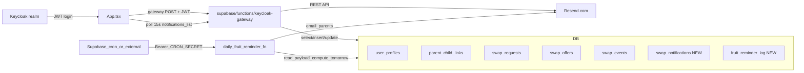

# Terv: többfelhasználós csere teszt, értesítések, reggeli gyümölcs emlékeztető

Ez a fájl a Cursor „Plans” tervének **másolata** (a Plans fájl gyakran a repón kívül van, pl. `C:\Users\39394\.cursor\plans\multi-user_swap_testing_setup_0d8665fb.plan.md`). A napi gyümölcs-emlékeztető ütemezése: **minden nap 07:00, Europe/Budapest**.

---

## Megvalósítási lépések (ajánlott sorrend)

A lépések úgy vannak sorba téve, hogy minél hamarabb legyen **működő vertikális szelet** (DB → gateway → frontend), és a kockázatosabb részek (napi emlékeztető, naptár-logika duplikálása) külön fázisban maradjanak.

### Fázis 0 — Előfeltételek

1. Supabase projekt: `migrations` alkalmazva lokálisan vagy SQL Editorben sorrendben (a meglévő init + swap migrációk már megvannak; az újak erre épülnek).
2. Keycloak elérhető, `keycloak-gateway` Edge Function deployolva, secret-ek beállítva (`SUPABASE_*`, `DEFAULT_GROUP_ID`, `KEYCLOAK_*`).
3. Resend fiók: API kulcs; teszteléshez `onboarding@resend.dev` vagy verifikált domain `from` cím.

### Fázis 1 — Adatbázis (új táblák + seed)

4. Migráció: `swap_notifications` tábla, indexek, RLS, `anon`/`authenticated` revoke (mint a terv 1.1).
5. Migráció: `fruit_reminder_log` tábla deduplikációhoz (1.2).
6. Válassz **4 fix UUID**-ot a Keycloak userek `id` + `keycloak_sub` + `user_profiles.id` egyeztetéséhez; dokumentáld a tervben és a `KEYCLOAK_SETUP.md`-ben.
7. Migráció: teszt `user_profiles` (4 szülő), `group_memberships` (`editor`), `parent_child_links` (négy gyerek: ABC első négy) — `on conflict` biztonságos (1.3).
8. Futtatás után ellenőrzés SQL-ben: `select * from parent_child_links where group_id = '<demo group>';`

### Fázis 2 — Keycloak felhasználók

9. `keycloak/realm/gyumolcsnaptar-realm.json`: 4 új user ugyanazzal a fix `id`-vel, mint a migrációban; `editor` realm role; jelszó, email.
10. Realm újraimport: **vagy** Keycloak admin UI-ban kézi user felvétel a megadott UUID-kkal **vagy** Docker volume reset (dokumentált, mert törli a meglévő realm adatot).
11. Első login mindegyik teszt userrel: ellenőrizd, hogy `user_profiles` upsert a gatewayben nem hoz létre ütközést (a `keycloak_sub` egyezzen a seed-del).

### Fázis 3 — Gateway: `load` + `swap_list` (alap jogosultság / láthatóság)

12. `load` válasz bővítése: lekérdezés `parent_child_links`-ből a bejelentkező `userId`-hez → `linkedChildren: string[]`.
13. `swap_list`: admin → változatlan teljes lista; **editor**: saját összes kérése (minden státusz) **+** csoport összes `requested` kérése (mások nyitott kérései, hogy lehessen ajánlatot adni).
14. Lokális teszt Postman/curl-lel JWT-vel: editor A látja B nyitott kérését; editor A nem látja B lezárt kérését (ha a terv szerint csak saját lezárt + mások nyitott).

### Fázis 4 — Gateway: értesítések + Resend (swap események)

15. `sendResendEmail(to, subject, html)` (vagy minimális fetch a Resend API-ra); env: `RESEND_API_KEY`, `RESEND_FROM_EMAIL`.
16. `notifyUsers(...)`: batch insert `swap_notifications`; hiba esetén email nélkül is maradjon a DB sor.
17. Címzettek szabályai implementálása eseményenként:
    - új csere kérés → csoport editorok + adminok, **kivéve** a kérést indító;
    - új ajánlat → kérés tulajdonosa + adminok;
    - elfogadás → ajánlattevő + kérvényező + adminok;
    - kérés/ajánlat visszavonás → meglévő terv szerinti érintettek.
18. Meghívás a meglévő swap action-ök végén (create offer, create request, approve, withdraw) — ugyanabban a request flow-ban, ahova most `swap_events` megy.

### Fázis 5 — Gateway: `notifications_list`, `notifications_mark_read`

19. Új actionök JWT auth után: lista `user_id = access.userId`, `order created_at desc`, limit 50.
20. `mark_read`: egy `id` vagy „mind olvasott” (`read_at = now()`).
21. Teszt: egy swap esemény után a címzett listában megjelenik a sor.

### Fázis 6 — Gateway: admin parent–child API

22. `parent_links_list` (admin): csoport összes link + user profil (név, email, id) a membership alapján.
23. `parent_links_set` (admin): adott `childName`-hez atomi replace: törlés régi linkek, insert új `user_id` lista (validálás: user tagja a csoportnak).
24. Teszt: admin módosít linket; editor `load` → friss `linkedChildren`.

### Fázis 7 — Frontend: `supabaseState` + `swapWorkflow`

25. `fetchGroupState` / `parse` bővítése optional `linkedChildren`-nel (gateway `load`).
26. `swapWorkflow.ts`: `loadNotifications`, `markNotificationsRead`, `loadParentLinks`, `setParentLinks` — ugyanaz a `callGateway` mint a swapnál.
27. `loadSwapRequests`: töröld vagy lazítsd a csak-admin korlátozást; viewer maradhat üres lista (ha a gateway úgyis 403).

### Fázis 8 — Frontend: App.tsx csere panel + szűrés

28. Eltávolítás: `VITE_SWAP_ADMIN_TEST_MODE`, `swapAdminTestEnabled`; helyette: bejelentkezve + `userRole !== 'viewer'` → swap panel látszik (viewer: csak olvasás / panel rejtve a terv szerint).
29. State: `linkedChildren` a cloud load-ból; refresh login / load után.
30. Csere dátum választó: **editor** esetén csak olyan munkanapok, ahol `assignedChildByDateKey` ∈ `linkedChildren`; **admin**: minden munkanap.
31. Meglévő handler-ek (`createSwapRequest`, stb.) átvezetése az új feltételre; hibaüzenetek magyarul.

### Fázis 9 — Frontend: NotificationBell

32. Komponens: ikon, badge (olvasatlan szám), dropdown lista.
33. `useEffect` poll 15 mp (és `focus` reload); hívás `notifications_list`.
34. „Összes olvasott” → `notifications_mark_read`.
35. Opcionális: kattintás scroll a csere panelhez.

### Fázis 10 — Frontend: ParentLinksAdminPanel

36. Csak `userRole === 'admin'`; betöltés `parent_links_list`.
37. UI: gyerek soronként multi-select felhasználók; mentés → `parent_links_set`.
38. Gyereklista forrása: aktuális `childrenText` / payload gyerekek (ahogy a naptárban).

### Fázis 11 — Napi gyümölcs-emlékeztető (cron)

39. Edge Function `daily-fruit-reminder` (vagy gateway cron action) + `CRON_SECRET` ellenőrzés headerben.
40. Logika: `Europe/Budapest` „holnap” dátumkulcs; munkanap + `monthOffDaysByMonth` szűrés; **kiosztott gyerek** meghatározása — kezdetben másolt/minimal calendar logika **vagy** közös modul kiemelése (lásd kockázat a 9. szakaszban).
41. `fruit_reminder_log` ellenőrzés insert előtt; sikeres küldés után log commit.
42. Resend email szülőknek (`parent_child_links` → email).
43. Ütemezés dokumentálása: pl. GitHub Actions cron `0 6 * * *` UTC ≈ 07:00 téli magyar idő — **fontos**: egyeztetni UTC vs `Europe/Budapest` (DST); megbízhatóbb: scheduler időzóna beállítása vagy explicit TZ a functionben.
44. Manuális teszt: POST a functionnak, dupla POST ugyanarra a napra → második no-op.

### Fázis 12 — Dokumentáció és takarítás

45. `KEYCLOAK_SETUP.md`, `SUPABASE_SETUP.md`: új migrációk, Resend, `CRON_SECRET`, ütemezés 07:00.
46. `.env.example` / `env.d.ts`: felesleges `VITE_SWAP_ADMIN_TEST_MODE` törlése.
47. `docs/PLAN_multi-user-swap-testing.md` és Cursor plan szinkron, ha közben változott a terv.

### Fázis 13 (később, nem blokkoló)

48. In-app `swap_notifications` a gyümölcs-emlékeztetőhöz is (`fruit_reminder_tomorrow`).
49. Supabase Realtime a `swap_notifications`-re Keycloak helyett vagy mellé (RLS + auth bonyolult).
50. Közös `calendarCore` modul Deno + Vite között, hogy a holnapi gyerek **byte-ra** egyezzen a UI-val.

---

## Architektúra



Folyamat röviden: szülő bejelentkezik Keycloakon, az Edge Function `load` hívás visszaadja a saját `linkedChildren` listát is. A szülő csak olyan napra tud cserét indítani, amelynek aktuális kiosztott neve szerepel a `linkedChildren`-ben. Új csere-esemény (kérés / ajánlat / elfogadás / visszavonás) hatására a gateway sorokat ír a `swap_notifications`-be a releváns userek számára, és párhuzamosan emailt küld Resenden keresztül. A frontend 15 másodpercenként pollozza a saját értesítéseit, harang ikon mutatja az olvasatlanok számát.

**Gyümölcsnap előtti emlékeztető (email):** egy külön, csak belső secret-tel hívható Edge Function (vagy a gateway egy `cron_fruit_reminders` action-je, ha egy helyen akarjuk a koden) **naponta egyszer** lefut. Kiolvassa a `group_calendar_state.payload`-ot, kiszámolja a **holnapi** dátumot egy fix időzónában (**Europe/Budapest**, hogy egyezzen az óvodai gyakorlattal), és eldönti, hogy holnap **tényleges „gyümölcsnap”**-e: hétköznap és **nem** szerepel a naptárban kivett (szünidő / extra szabad) napok között (`monthOffDaysByMonth` + `manualOverridesByMonth` / `childrenText` / `startChildByMonth` logika — **ugyanaz a szabály**, mint a React [`src/calendar.ts`](../src/calendar.ts)-ben: ugyanazzal a kiosztási sorrenddel kell megkapni a holnapi gyereknevet). A kiosztott **gyerek** alapján a `parent_child_links`-ből kikerülnek az érintett szülők (`user_profiles.email`); mindegyik kap egy Resend emailt (tárgy pl. „Holnap gyümölcsnap: …”). **In-app haranghoz** ez opcionális v1-ben (csak email is elég a kérés szerint); később ugyanígy `swap_notifications` sor is írható `event_type: fruit_reminder_tomorrow`.

**Duplikáció elkerülése:** `fruit_reminder_log` tábla `(group_id, reminder_for_date)` egyedi kulccsal — ha ugyanarra a céldátumra már mentünk sort, a cron a következő futáskor nem küld újra emailt (így többszöri manuális trigger vagy időzóna-hiba sem spammel).

## 1. Adatbázis migrációk

### 1.1 Új `swap_notifications` tábla és RLS — `supabase/migrations/20260429140000_swap_notifications.sql`

```sql
create table public.swap_notifications (
  id uuid primary key default gen_random_uuid(),
  group_id uuid not null references public.groups(id) on delete cascade,
  user_id uuid not null references public.user_profiles(id) on delete cascade,
  request_id uuid null references public.swap_requests(id) on delete cascade,
  offer_id uuid null references public.swap_offers(id) on delete cascade,
  event_type text not null,
  title text not null,
  body text,
  payload jsonb not null default '{}'::jsonb,
  read_at timestamptz null,
  created_at timestamptz not null default now()
);
create index idx_swap_notifications_user_unread on public.swap_notifications (user_id, read_at);
alter table public.swap_notifications enable row level security;
revoke all on public.swap_notifications from anon, authenticated;
```

### 1.2 Gyümölcs-emlékeztető napló — `supabase/migrations/20260429141500_fruit_reminder_log.sql` (vagy egyesítve az 1.1-gyel)

- `fruit_reminder_log (id, group_id, reminder_for_date date, sent_at timestamptz default now(), primary key (group_id, reminder_for_date))`
- RLS: service role only (anon tiltva) — csak az Edge Function írja

### 1.3 Teszt szülők seed-elése — `supabase/migrations/20260429141000_test_parents_seed.sql`

- Beszúr 4 user_profiles sort fix `id` és `keycloak_sub` UUID-okkal (ezek bekerülnek a Keycloak realm JSON-ba is `id`-ként, így match-elnek)
- 4 group_memberships sor `editor` szerepkörrel
- 4 parent_child_links sor: `Balassa-Molcsán Hunor`, `Baló Olívia`, `Burik Bendegúz`, `Czakó Adél Luca`
- Mind `on conflict do nothing`/`do update`, biztonságos újrafuttatáshoz

## 2. Keycloak realm bővítés — `keycloak/realm/gyumolcsnaptar-realm.json`

A `users` tömbbe 4 új user kerül stabil `id` UUID-dal:

- `szulo1.demo` (Balassa-Molcsán Hunor szülője), email `szulo1@example.com`, jelszó `ChangeMe123!`, role `editor`
- `szulo2.demo` (Baló Olívia)
- `szulo3.demo` (Burik Bendegúz)
- `szulo4.demo` (Czakó Adél Luca)

Az `id` mezőkbe írt UUID-okat használja a `20260429141000_test_parents_seed.sql` is `keycloak_sub`-ként. Mivel a realm import csak első indításkor fut le, a `KEYCLOAK_SETUP.md` kapni fog egy "Hogyan érvényesítsd" szakaszt: vagy a Docker volume törlése + újraindítás, vagy a 4 user kézi felvétele a Keycloak admin UI-n a megadott `id`-kkal.

## 3. Edge Function — `supabase/functions/keycloak-gateway/index.ts`

- Új helper: `notifyUsers(groupId, recipients[], event)` — beír a `swap_notifications`-be soronként + ha `RESEND_API_KEY` van, küld emailt Resend `POST https://api.resend.com/emails`-re
- `swap_request_create` után: értesítést kap a csoport összes editor/admin tagja (kivéve az indító) — "Új csere kérés: <gyereknév>, <dátum>"
- `swap_offer_create` után: értesítést kap a kérés tulajdonosa + adminok — "Új csereajánlat a kérésedre"
- `swap_request_approve` után: értesítést kap az ajánlattevő + a kérvényező + adminok — "Csere lezárult: <X> ↔ <Y>"
- `swap_request_withdraw` és `swap_offer_withdraw` után: érintettek értesítést kapnak
- Új action-ök:
  - `notifications_list` → visszaadja a hívó user `swap_notifications` sorait (top 50, frissek elöl)
  - `notifications_mark_read` (opcionális `id`, vagy ha üres → mark all read)
  - `parent_links_list` (admin) → join `parent_child_links` × `user_profiles` × `group_memberships` a csoportra, ezt használja az admin UI
  - `parent_links_set` (admin) → body: `{ childName, userIds[] }`, törli a meglévőket a gyerekre, beszúrja az újakat
- A `load` action válasza kibővül egy `linkedChildren: string[]` mezővel (a hívó user saját parent_child_links rekordjai)
- A `swap_list` action eredménye non-admin esetén:
  - saját kérések minden státusszal
  - csoport többi `requested` státuszú kérése (lehetséges ajánlatadási targetek)
  - admin változatlanul mindent visszaad

## 4. Frontend

### 4.1 swapWorkflow.ts — új gateway hívások

- `loadNotifications`, `markNotificationsRead`
- `loadParentLinks`, `setParentLinks`
- A `loadSwapRequests` jelenlegi `params.role === 'viewer'` korai return marad, a többi role-t a backend szűri

### 4.2 `src/App.tsx` — gating cseréje

- A 90. sor `SWAP_ADMIN_TEST_MODE` flag eltűnik (env változó is kerül a `.env.example`-ből és `env.d.ts`-ből)
- A 738-739 körüli `swapAdminTestEnabled` helyett: `swapPanelEnabled = KEYCLOAK_AUTH && isAuthenticated && userRole !== 'viewer'`
- Új state: `linkedChildren: string[]` — `fetchGroupState` válaszából (`load` action visszaadja)
- Új state: `notifications: SwapNotification[]`, `notificationsUnread: number`
- A 1272–1296 közötti `handleCreateSwapRequest` előtt egy `selectableSwapDateKeys` memo: editor esetén csak azok a `monthDateKeys`, ahol `assignedChildByDateKey.get(key) ∈ linkedChildren`; admin: minden working day
- A "csere kezdeményezése" date input opciói erre szűrődnek; ha üres a halmaz, üzenet: "A bejelentkezett userhez nincs gyerek rendelve."

### 4.3 Új `NotificationBell` komponens (App.tsx-en belül vagy külön fájl)

- Felül a header sávban harang ikon, badge-en az olvasatlanok száma
- Lenyíló dropdown: utolsó 20 értesítés, dátummal, "olvasottá tétel mind" gomb
- Kattintásra a kapcsolódó request panelre fókuszál (scroll + highlight, opcionális v1-ben)
- Polling: `setInterval` 15s-enként `loadNotifications`, plusz `window.addEventListener('focus', ...)` újratöltés
- Új csere/ajánlat/lezárás után az actor saját `refreshSwapRequests()` hívása már most is megtörténik

### 4.4 Új `ParentLinksAdminPanel` komponens (csak admin)

- A Settings panel mellett vagy alatt, "Szülő-gyerek hozzárendelés" cím
- Táblázat: gyerek neve | hozzárendelt szülők (multi-select dropdown a `parent_links_list`-ből visszaadott user_profiles listából)
- "Mentés" gomb soronként → `setParentLinks({ childName, userIds })`
- Új gyerek hozzáadását nem kezeli most (a children listából jönnek, ami már a fő paneles input)

## 5. Napi gyümölcs-emlékeztető (cron + email)

- **Új Edge Function** `supabase/functions/daily-fruit-reminder/index.ts` (ajánlott: külön fájl, hogy a gateway JWT logikája ne keveredjen), **vagy** `keycloak`-gateway új action: `cron_fruit_reminders`, body üres, header `Authorization: Bearer <CRON_SECRET>`.
- Környezet: `SUPABASE_URL`, `SUPABASE_SERVICE_ROLE_KEY`, `DEFAULT_GROUP_ID` (vagy később: minden `groups` sorra loop), `CRON_SECRET`, `RESEND_*`, opcionálisan `REMINDER_TIMEZONE=Europe/Budapest`.
- Algoritmus röviden: `reminder_for_date = holnap` (helyi TZ); ha nem „munkanap a naptár szerint”, `200 { skipped: true }`; egyébként payload-ból **ugyanazzal a logikával** kiosztott gyereknév; `parent_child_links` + `user_profiles`; üres email → skip user + log; sikeres küldés után `fruit_reminder_log` insert **commit előtt** dedup.
- **Ütemezés:** Supabase „Edge Function » Schedules” (ha elérhető a projektben), vagy GitHub Actions `cron:` vagy külső (cron-job.org). **Konkrét érték:** minden nap **07:00** **Europe/Budapest** (reggel); a function továbbra is a *holnapi* dátumot számolja ki a helyi naptár szerint.
- **Edge case:** ünnepnap — ha a naptár `isPublicHolidayDate` alapján kihagy napokat, a Deno oldalon vagy importáljuk a nyilvános ünnep listát (mint a frontend), vagy v1-ben csak hétvége + `monthOffDaysByMonth` szűrés (dokumentált limitáció).

## 6. Email integráció (Resend)

- Edge Function új env secret-ek:
  - `RESEND_API_KEY`
  - `RESEND_FROM_EMAIL` (pl. `Gyümölcsnaptár <noreply@gyuminaptar.hu>` – a Resend dashboardon verifikált domain szükséges)
- A `notifyUsers` helper email-enként hív egyet a Resend REST API-ra; ha hiba, csak warning log, az értesítés DB-ben már megvan
- Sablon: egyszerű HTML (h2 + p + link az appra `https://next.gyuminaptar.hu`)

## 7. Tesztelési forgatókönyv (a runbookba)

- Admin (`admin.demo`) bejelentkezik → látja a "Szülő-gyerek hozzárendelés" panelt; ellenőrzi a 4 seed mappinget; tetszőlegesen módosíthatja
- `szulo1.demo` bejelentkezik → csak Balassa-Molcsán Hunor napjaira tud cserét indítani; harang üres
- `szulo1.demo` indít cserét egy adott napra → `szulo2-4.demo` és admin email + in-app értesítést kap
- `szulo2.demo` ad ajánlatot → `szulo1.demo` és admin értesítést kap
- `szulo1.demo` elfogadja → `szulo2.demo` + admin értesítést kap, naptár frissül mindenkinek a következő `load` lekéréskor
- `szulo1.demo` visszavonhatja saját kérését; `szulo2.demo` visszavonhatja saját ajánlatát
- **Gyümölcs emlékeztető:** manuális HTTP POST a cron functionra (Bearer `CRON_SECRET`); ellenőrizni, hogy a holnapi naphoz tartozó gyerek szülei megkapják az emailt; második hívás ugyanarra a napra nem küld duplikátumot (`fruit_reminder_log`)

## 8. Dokumentáció és env

- `KEYCLOAK_SETUP.md`: új szakasz "4 teszt szülő hozzáadása" + "Email értesítés (Resend) bekapcsolása" + "Napi gyümölcs-emlékeztető cron (`CRON_SECRET`, deploy `daily-fruit-reminder`, **07:00 Europe/Budapest**)"
- `SUPABASE_SETUP.md` (vagy KEYCLOAK_SETUP-ban): új migrációk listája, `RESEND_API_KEY` és `RESEND_FROM_EMAIL` secret beállítás
- `.env.example`: `VITE_SWAP_ADMIN_TEST_MODE` sor törölhető (ha eddig nem volt benne, akkor csak a `src/env.d.ts` módosul)

## 9. Megjegyzések / kockázatok

- A "valós idejű" rész polling alapú (15s) a teszt fázisban: a Supabase Realtime használatához vagy a Supabase auth-ot kellene mirror-elni a Keycloak userekhez, vagy szélesebb RLS-t adni — ezek nagyobb refaktort igényelnek, és későbbi feladatként visszahozhatók
- A Keycloak realm JSON újra-importálása csak a `keycloak_data` Docker volume törlésével működik; production Keycloakon a 4 usert kézzel kell felvenni a megadott `id` UUID-okkal, vagy a Keycloak REST API-n
- Resend domain verifikáció a `gyuminaptar.hu`-n szükséges, addig a `from` lehet `onboarding@resend.dev` (Resend default sandbox) — a tesztben ez használható
- A holnapi kiosztás számítása **kritikus pont**: ha eltér a frontendtől, rossz szülő kap emlékeztetőt. Érdemes a `generateAssignments` / hónap munkanap logikát egy megosztható modulba kiemelni (pl. `src/calendar.ts` → később `shared/calendarCore.ts` amit Deno is importálhat), vagy az első verzióban dokumentáltan ugyanazt a kódot másolni és teszttel egyeztetni
